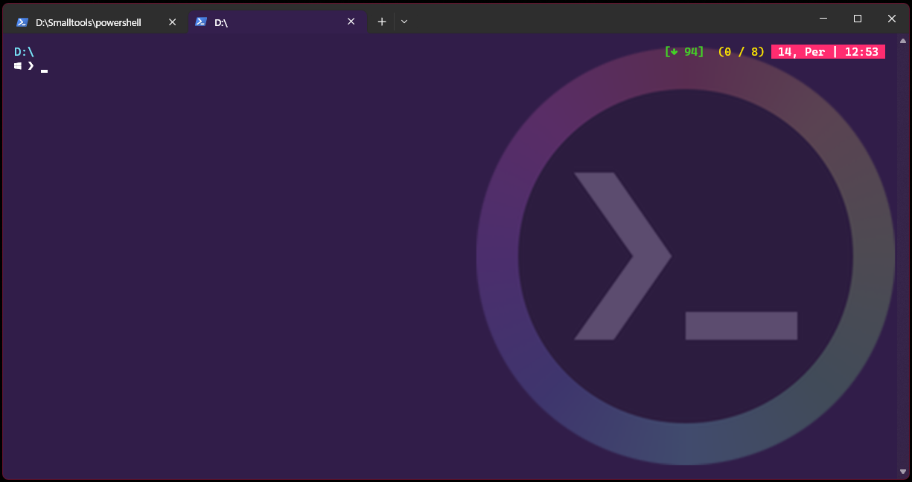
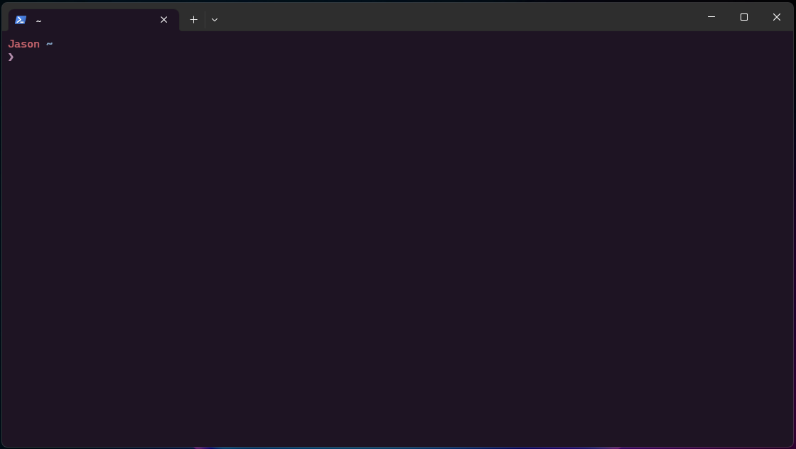
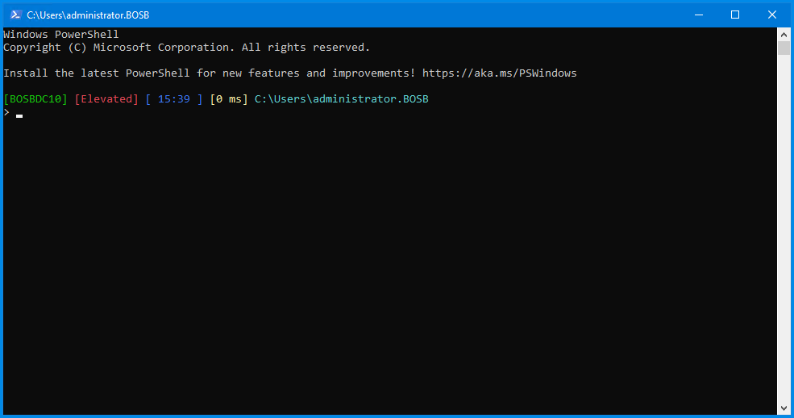

# powershell

Available functions:
- Get-DriveSpace
- Get-MonitorInfo
- Get-Uptime
- Get-RebootInfoW
- Get-HwInfo
- Get-OSInfo
- Get-BiosParams
- Get-Lockouts
- Get-LockoutLocation
- Get-FileMetaData
- Get-RebootReason
- Get-MemoryConsumed
- Get-LongNames
- Get-PageTime
- Play-Sound
- Get-PendingReboot
- Get-MemoryTotals
- Get-LastCommandExecutionTime
- Get-NewFiles
- Get-Currency
- Compare-Tree
- Compare-File
- Get-Encoding
- Get-LoggedinUser
- Get-DuplicateFiles
- Get-IPwhois
- Get-MOInstalledPrograms

- [Theme 1 json file](profile1.json)
- [Windows Terminal config file](settings1.json)

- [Theme 2 json file](profile2.json)
- [Windows Terminal config file](settings2.json)

- [Theme 3 json file](profile3.json)
- No json file, since not based on Windows Terminal
