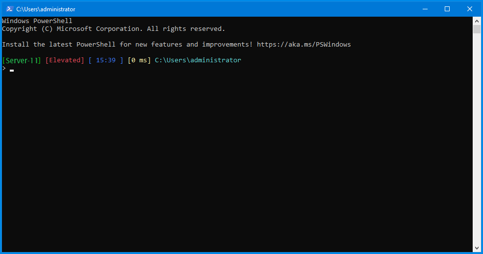

# powershell
my library

[Theme 1 json file](profile1.json)
[Windows Terminal config file](settings1.json)

[Theme 2 json file](profile2.json)
[Windows Terminal config file](settings2.json)

[Theme 3 json file](profile3.json)
